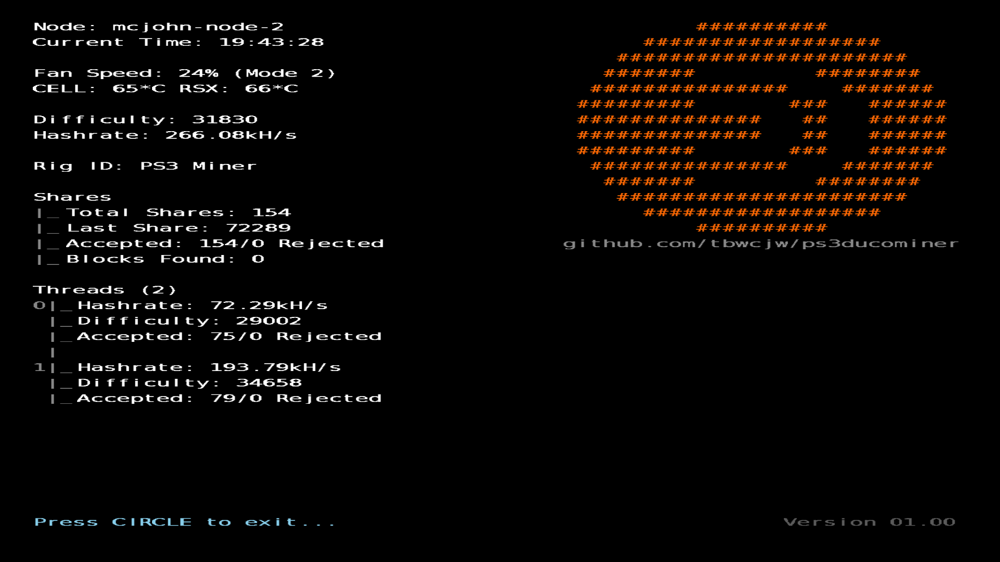
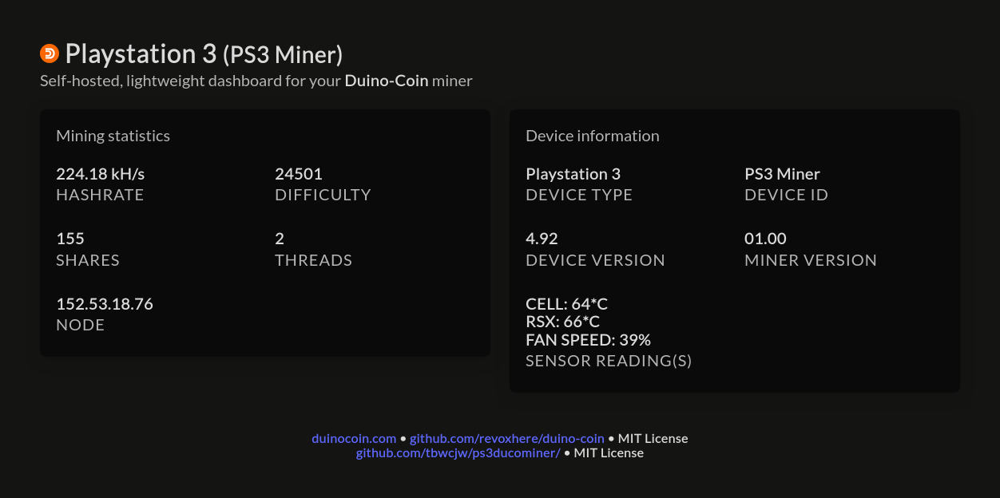

 <!-- todo -->

    <h2 align="center">ps3ducominer</h2>

    A multithreaded <a href='https://duinocoin.com'>DUCO</a> Miner for the Playstation 3.

<h3>Preface</h3>

This application is a port of my DUCO miner '<a href='https://github.com/tbwcjw/nxducominer'>nxducominer</a>' for the Nintendo Switch.

<h4>Notice</h4>

While it may be tempting to leave a PlayStation 3 system running 24/7, I strongly advise against doing so. Even the newest PS3 hardware is now well over a decade old, and prolonged continuous operation puts significant stress on its components. I am in no way responsible for any damage, hardware failure, or data loss that may occur from running your PS3 in this manner. Proceed at your own risk.

<h3>Setup</h3>

Upon first launch, ps3ducominer will create <code>ps3ducominer.txt</code> in <code>/dev_hdd0/tmp</code> with the values below. Open the file and set the values accordingly.

<table id="config">
    <thead>
        <tr>
            <th>Key</th>
            <th>Type</th>
            <th>Description</th>
        </tr>
    </thead>
    <tbody>
        <tr>
            <td><code>node</code></td>
            <td><code>str</code> <code>none</code></td>
            <td>The IP address of the node to connect to. Can be found manually <a href='https://server.duinocoin.com/getPool'>here</a>. If left empty the application will use <a href='http://server.duinocoin.com/getPool'>http://server.duinocoin.com/getPool</a> to find one.
        </tr>
        <tr>
            <td><code>port</code></td>
            <td><code>int</code> <code>none</code></td>
            <td>The port of the node. If this is left blank, the application will find a node using the method above. Regardless if the <code>node</code> is set.</td>
        </tr>
        <tr>
            <td><code>wallet_address</code></td>
            <td><code>str</code></td>
            <td>The address/username of your duinocoin wallet.
        </tr>
        <tr>
            <td><code>miner_key</code></td>
            <td><code>str</code> <code>none</code></td>
            <td>As specified in <code>Wallet > Settings > Miner Key</code>. Leave blank if not applicable.</td>
        </tr>
        <tr>
            <td><code>difficulty</code></td>
            <td><code>str</code></td>
            <td>The starting difficulty. The node will automatically negotiate the difficulty. Valid starting difficulties are <code>LOW</code> <code>MEDIUM</code> <code>NET</code> and <code>EXTREME</code>. <b><code>LOW</code> is recommended for this application.</b> <CODE>EXTREME</code> is not used anywhere officially. More information on difficulties can be found <a href='https://github.com/revoxhere/duino-coin/tree/useful-tools?tab=readme-ov-file#duco-s1-mining'>here</a>.</td> 
        </tr>
        <tr>
            <td><code>rig_id</code></td>
            <td><code>str</code></td>
            <td>A friendly name for your miner which displays in the wallet.</td>
        </tr>
        <tr>
            <td><code>iot</code></td>
            <td><code>bool</code> </td>
            <td>Either <code>true</code> or <code>false</code>. Upload IoT data to your wallet (CPU & RSX Temperatures, Fan Speed).</td>
        </tr>
        <tr>
            <td><code>threads</code></td>
            <td><code>int</code> </td>
            <td>Number of threads to mine on. Between 1 and 6.</td>
        </tr>
        <tr>
            <td><code>web_dashboard</code></td>
            <td><code>bool</code> </td>
            <td>Either <code>true</code> or <code>false</code>. The web dashboard will run on port 8080 of the PS3's IP address.</td>
        </tr>
    </tbody>
</table>

<h3>Debugging</h3>
To enable remote debugging set these flags in <code>CFLAGS</code>:

<pre><code>-DDEBUG -DDEBUG_ADDR=\"target_ip\" -DDEBUG_PORT=\"target_port\"</code></pre>

You can use the included <code>udpdebug.py</code> or something like <code>nc -u -l -p port</code> to view debugging output.

If you are using PS3LoadX to send <code>.self, .pkg</code> files to the PS3 set <code>-DPS3LOADX</code> in <code>CFLAGS</code>.

<h3>Building</h3>
You will need to build and install the psl1ght toolchain, including ps3libraries, as well as pthread-emb-ps3.

<h4>Installation of required library <code>pthread-emb-ps3</code></h4>

Source: <a href='https://github.com/humbertodias/pthread-emb-ps3'>https://github.com/humbertodias/pthread-emb-ps3</a>

<b>Build & Install</b>:
<pre><code>make cmake-build
make cmake-install
</code></pre>

If you encountered this error:

<pre><code>/path/to/ps3dev/ppu/include/sys/atomic.h:301:54: error: 'newv' undeclared (first use in this function)
 #define sysAtomicSwap(v, new) (xchg(&((v)->counter), newv))
</code></pre>

Modify this line in <code>/path/to/ps3dev/ppu/include/sys/atomic.h</code>:
<pre><code>#define sysAtomicSwap(v, new) (xchg(&((v)->counter), newv))
                         ^^^
</code></pre>

to read:

<pre><code>#define sysAtomicSwap(v, newv) (xchg(&((v)->counter), newv))</code></pre>

<h3>Screenshots</h3>

 
<i>Application</i>
 
<i>Web dashboard</i>

### Credits:

pthread-emb-ps3 (pthread library for psl1ght): <a href='https://github.com/humbertodias/pthread-emb-ps3'>humbertodias/pthread-emb-ps3</a>

jsmn (json parser): <a href='https://github.com/zserge/jsmn'>zserge/jsmn</a>

### License:

This software is licensed under the <a href=''>MIT License</a>.

This application was created with the official non-official SDK called PSL1GHT, for more information visit <a href='http://www.psl1ght.com/'>http://www.psl1ght.com/</a>. This is in no way associated with Sony Computer Entertainment Inc., please do not contact them for help, they will not be able to provide it.
